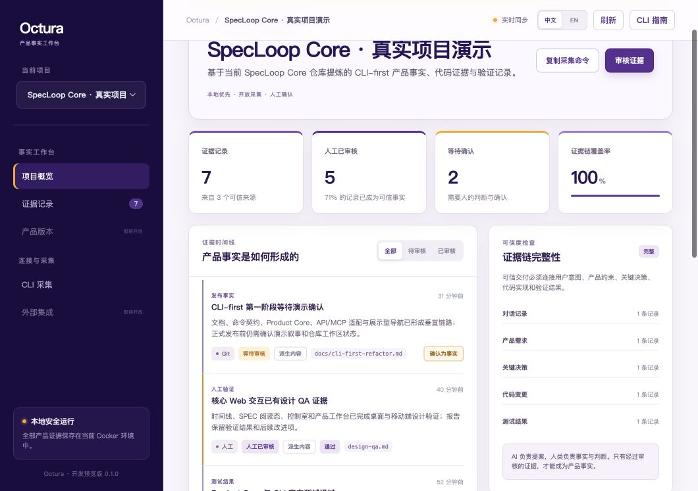
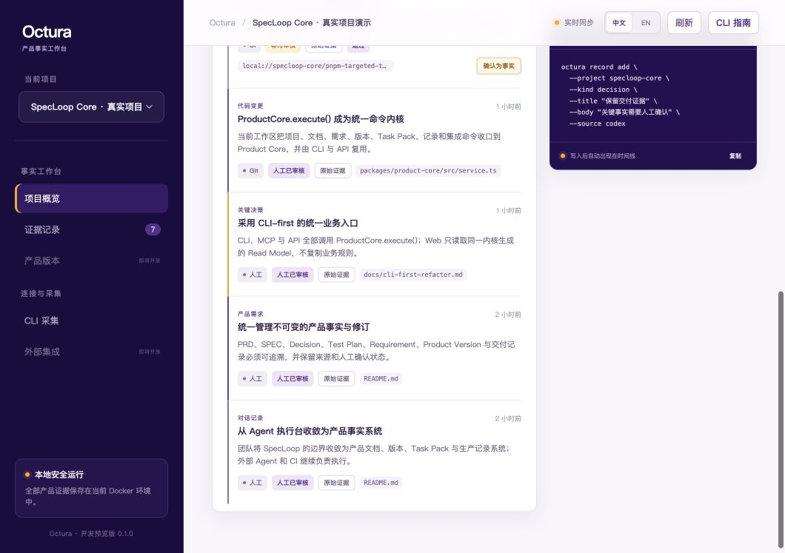

# Octura

**AI 软件交付的产品事实与证据工作台。**

Evidence OS for AI software delivery.

Octura 把 AI 辅助开发中的对话、需求、决策、代码引用、测试和人工验证，保存为一条可查询、可审核、可追溯的产品事实链。

它不执行代码，也不替代 Codex、Cursor、Claude Code、GitHub 或 CI。Octura 专门回答四个问题：

- 为什么要做这次变更？
- AI 和人分别做了什么？
- 证据来自哪里？
- 哪些内容已经由人确认？



## 3 分钟运行演示

需要 Docker Desktop 或兼容的 Docker Engine。

```bash
git clone https://github.com/fullstackinnoAI/octura.git
cd octura
docker compose up --build -d
docker compose exec octura octura-demo-seed --profile specloop-core
```

打开 [http://localhost:3000/?project=specloop-core](http://localhost:3000/?project=specloop-core)。

`specloop-core` profile 会生成一套来自真实项目的演示档案：

- 7 条产品证据；
- 5 条已经人工确认，2 条等待确认；
- 覆盖对话、需求、决策、代码和测试五个必要环节；
- 证据链覆盖率为 100%。

不加 `--profile` 时会生成通用的 `octura-demo` 项目：

```bash
docker compose exec octura octura-demo-seed
```

检查服务和数据库：

```bash
docker compose exec octura octura-doctor
```

预期输出：

```text
● Octura 0.1.0 运行正常
  API       http://localhost:3000
  数据库    connected
```

Web 工作台右上角支持中文 / English 即时切换，并会记住选择。系统文案随语言切换，项目和证据内容保留采集时的原文。

## 新版 CLI 约定

Octura 现在只提供单段式、以连字符连接的可执行命令：

```text
octura-doctor
octura-demo-seed
octura-project-create
octura-project-list
octura-record-add
octura-record-list
octura-record-review
octura-spec-kit-import
```

旧的 `octura doctor`、`octura demo seed`、`octura record add` 等多段式写法已经删除，不再兼容。使用 Docker 时，只需在新命令前加 `docker compose exec octura`：

```bash
docker compose exec octura octura-record-list --project octura-demo
```

README 中直接使用 `octura-*` 的示例，表示这些入口已经安装或链接到当前 `PATH`。在源码仓库中开发时，可以用 pnpm 作为命令运行器：

```bash
pnpm octura-doctor
OCTURA_API_URL=http://localhost:3000 pnpm octura-project-list --json
```

CLI 使用同一条事实确认流程：

```text
创建项目 → 采集证据 → captured（待审核）→ 人工确认 → reviewed（产品事实）
```

每条记录都保存类型、来源、执行者、原始或派生属性、外部引用与审核状态。AI 和自动化可以采集记录，但只有人工确认才能把记录变为 `reviewed`。

## 案例一：为 AI Checkout 建立证据链

下面的案例记录一次“将支付重试改为异步队列”的完整交付过程。

### 1. 创建项目

`octura-project-create` 使用同一 `slug` 重复执行时会更新项目，不会创建重复项目。

```bash
docker compose exec octura octura-project-create \
  --slug checkout-ai \
  --name "AI Checkout" \
  --description "AI 辅助改造结账流程的交付档案"
```

确认项目已经存在：

```bash
docker compose exec octura octura-project-list
```

### 2. 记录需求与决策

先保存产品需求：

```bash
docker compose exec octura octura-record-add \
  --project checkout-ai \
  --kind requirement \
  --title "支付请求必须可以安全重试" \
  --body "同一支付请求重复到达时不能重复扣款，并且失败重试不能阻塞结账请求。" \
  --source human \
  --actor "product-owner" \
  --external-ref "docs/requirements/payment-retry.md" \
  --idempotency-key "requirement-payment-retry-v1"
```

再保存关键方案决策：

```bash
docker compose exec octura octura-record-add \
  --project checkout-ai \
  --kind decision \
  --title "支付重试改为队列驱动" \
  --body "同步重试会放大支付网关故障；改为带幂等键的异步队列，最多重试三次。" \
  --source human \
  --actor "tech-lead" \
  --external-ref "docs/decisions/payment-retry.md" \
  --idempotency-key "decision-payment-retry-v1"
```

新记录默认是 `captured`。`--idempotency-key` 允许 Agent 或自动化安全重试同一次写入。

正文较长时可以改用 `--body-file`。文件路径必须在执行 CLI 的环境中可见；Docker 示例需要先复制文件：

```bash
docker compose cp ./payment-retry-requirement.md octura:/tmp/payment-retry-requirement.md
docker compose exec octura octura-record-add \
  --project checkout-ai \
  --kind requirement \
  --title "支付重试详细验收标准" \
  --body-file /tmp/payment-retry-requirement.md \
  --source human
```

### 3. 记录实现与测试

```bash
docker compose exec octura octura-record-add \
  --project checkout-ai \
  --kind code \
  --title "实现支付重试队列" \
  --body "新增幂等消费和指数退避，支付请求不再在 HTTP 请求内同步重试。" \
  --source git \
  --actor "codex" \
  --external-ref "git:main:src/payments/retry-worker.ts"
```

测试证据可以通过 `--meta` 携带 JSON 元数据：

```bash
docker compose exec octura octura-record-add \
  --project checkout-ai \
  --kind test \
  --title "支付重试集成测试通过" \
  --body "覆盖成功、超时、重复消息和第三次失败进入死信队列。" \
  --source ci \
  --actor "github-actions" \
  --external-ref "https://github.com/example/checkout/actions/runs/123" \
  --meta '{"verdict":"passed","tests":18,"environment":"ci"}'
```

### 4. 查询并人工确认

列出所有等待审核的记录：

```bash
docker compose exec octura octura-record-list \
  --project checkout-ai \
  --status captured
```

也可以同时按类型或来源过滤：

```bash
docker compose exec octura octura-record-list \
  --project checkout-ai \
  --kind test \
  --source ci
```

从查询结果取得记录 ID 后进行人工确认：

```bash
RECORD_ID="把查询结果中的完整记录 ID 粘贴到这里"

docker compose exec octura octura-record-review \
  --project checkout-ai \
  --id "$RECORD_ID" \
  --actor "release-owner" \
  --note "已核对需求、实现位置和测试结果"
```

审核后状态变为 `reviewed`。也可以在 Web 时间线中点击“确认为事实”。



## 案例二：读取已有 Spec Kit 项目

Octura 兼容 Spec Kit 的 idea assessment 与 delivery artifacts，并把 `.specify/` 和 `specs/` 作为只读上游。Octura 自己的项目文件只写入 `.octura/`，导入索引使用带 `oct-` 前缀的路径：

```text
project-root/
├── .specify/                              # Spec Kit 所有，Octura 只读
├── specs/                                 # Spec Kit 所有，Octura 只读
└── .octura/                               # Octura 所有
    └── oct-imports/
        └── oct-spec-kit-index.json
```

先预览发现结果。`--dry-run` 不写 API，也不创建本地索引：

```bash
octura-spec-kit-import \
  --root /path/to/spec-kit-project \
  --project checkout-ai \
  --dry-run
```

确认后导入正在本机运行的 Octura：

```bash
OCTURA_API_URL=http://localhost:3000 octura-spec-kit-import \
  --root /path/to/spec-kit-project \
  --project checkout-ai \
  --name "AI Checkout"
```

如果未提供 `--project`，命令会根据项目根目录名称生成 slug。重复导入相同内容会复用既有记录；源文件发生变化时会新增证据修订。

只查询 Spec Kit 来源的记录：

```bash
octura-record-list \
  --project checkout-ai \
  --source spec-kit
```

Spec Kit 的 `go` 决定导入后仍是 `captured`，不会自动成为 Octura 产品事实。使用 `octura-record-review` 进行人工确认。完整的文件映射和安全边界见 [Octura × Spec Kit 兼容设计](docs/spec-kit-compatibility.md)。

## 给 Agent 和脚本使用

所有 CLI 命令都支持 `--json`。输出是稳定的 JSON，适合 Codex、CI 或本地脚本继续处理。

```bash
docker compose exec octura octura-record-list \
  --project checkout-ai \
  --status captured \
  --json
```

使用 `jq` 取得第一条待审核记录：

```bash
RECORD_ID=$(docker compose exec -T octura octura-record-list \
  --project checkout-ai \
  --status captured \
  --json | jq -r '.[0].id')

docker compose exec octura octura-record-review \
  --project checkout-ai \
  --id "$RECORD_ID" \
  --actor "release-owner"
```

如果 CLI 不在 Docker 容器中，使用 `OCTURA_API_URL` 指向 Octura API：

```bash
OCTURA_API_URL=http://localhost:3000 octura-doctor
```

## CLI 命令速查

| 命令 | 主要参数 | 用途 |
| --- | --- | --- |
| `octura-doctor` | `[--json]` | 检查 API 与 PostgreSQL 连接 |
| `octura-demo-seed` | `[--profile specloop-core] [--slug <slug>] [--name <name>] [--json]` | 生成通用或 SpecLoop Core 演示档案 |
| `octura-project-create` | `--slug <slug> [--name <name>] [--description <text>] [--json]` | 创建项目；相同 slug 时更新项目 |
| `octura-project-list` | `[--json]` | 列出全部项目 |
| `octura-record-add` | `--project <slug> --kind <kind> --title <title> (--body <text> \| --body-file <path>)` | 采集一条待审核证据 |
| `octura-record-list` | `--project <slug> [--status <status>] [--kind <kind>] [--source <source>] [--json]` | 查询和过滤证据记录 |
| `octura-record-review` | `--project <slug> --id <record-id> [--actor <name>] [--note <text>] [--json]` | 人工确认一条证据 |
| `octura-spec-kit-import` | `[--root <path>] [--project <slug>] [--name <name>] [--dry-run] [--json]` | 只读发现并导入 Spec Kit 记录 |

`octura-record-add` 还支持 `--source`、`--actor`、`--external-ref`、`--truth`、`--meta` 与 `--idempotency-key`。`--body` 和 `--body-file` 二选一；未指定 `--source` 时默认为 `human`，未指定 `--actor` 时默认为 `local-user`。

常用短参数：

```text
-s --slug        -n --name        -d --description
-r --root        -p --project     -k --kind
-t --title       -b --body        -h --help
```

记录类型：

| `kind` | 典型内容 |
| --- | --- |
| `conversation` | 用户意图、讨论与上下文 |
| `requirement` | 产品需求与验收标准 |
| `decision` | 关键取舍及其原因 |
| `code` | 实现位置、提交或代码引用 |
| `test` | 自动化测试与 CI 结果 |
| `verification` | 人工验收和设计 QA |
| `release` | 发布判断与发布事实 |

证据来源：

```text
human / codex / cursor / claude / git / ci / api / spec-kit / other
```

任意命令入口都可以查看帮助：

```bash
docker compose exec octura octura-record-add --help
```

## 现场分享建议

1. 先打开 [SpecLoop Core 演示项目](http://localhost:3000/?project=specloop-core)。
2. 用 `octura-record-add` 现场写入一条 `decision` 记录。
3. 等待最多 6 秒，记录会自动出现在时间线并显示“等待审核”。
4. 解释 raw evidence 与 reviewed fact 的区别。
5. 在页面或 CLI 中完成人工确认。

完整话术见 [中文演示脚本](docs/demo-script-zh.md)，真实档案来源见 [SpecLoop Core 演示档案](docs/specloop-core-demo-profile.md)。

## 数据与停止服务

停止容器：

```bash
docker compose down
```

数据保存在名为 `octura_data` 的 Docker volume 中。普通的 `docker compose down` 不会删除数据。

如果明确要清空所有 Octura 本地数据：

```bash
docker compose down -v
```

> 这会永久删除当前 Docker volume 中的项目和证据记录。

## 常见问题

### CLI 提示无法连接 Octura

先确认容器状态：

```bash
docker compose ps
docker compose exec octura octura-doctor
```

如果镜像或代码刚刚更新，重新构建：

```bash
docker compose up --build -d
```

### `localhost:3000` 已被占用

修改 `docker-compose.yml` 中的端口映射，例如改为 `3100:3000`，然后访问 `http://localhost:3100`。

### 重复执行 `octura-demo-seed` 会不会产生重复数据

不会。演示记录使用固定 idempotency key，重复执行会复用同一条记录。

### 为什么 AI 不能自动把记录标为 reviewed

Octura 的边界是：AI 可以生成命令、查询和草稿，但不能生成事实。`reviewed` 表示有人愿意对这条事实承担判断责任。

## 最小架构

```text
Octura CLI ─┐
            ├── HTTP API ── Product contracts ── PostgreSQL
Web UI ─────┘                                  └── immutable evidence trail
```

- CLI 是 Agent、CI 和自动化的接入表面。
- API 提供稳定的 `octura.api.v1` JSON envelope。
- PostgreSQL 保存来源、actor、raw/derived 和审核状态。
- Web 负责展示、追踪和人工确认事实。

## 本地开发

需要 Node.js 20+、pnpm 9+ 和 PostgreSQL。

```bash
pnpm install
cp .env.example .env
pnpm dev
```

另一个终端中：

```bash
pnpm octura-doctor
pnpm octura-demo-seed --profile specloop-core
```

质量检查：

```bash
pnpm typecheck
pnpm test
pnpm build
```

## Developer Preview 范围

当前版本已覆盖本地最小证据闭环。暂未实现：

- 登录、多租户和远端同步；
- GitHub、Codex 与 CI 自动导入；
- Product Version Manifest；
- 云端部署与计费。

这些能力会在设计伙伴验证当前闭环后继续建设。
