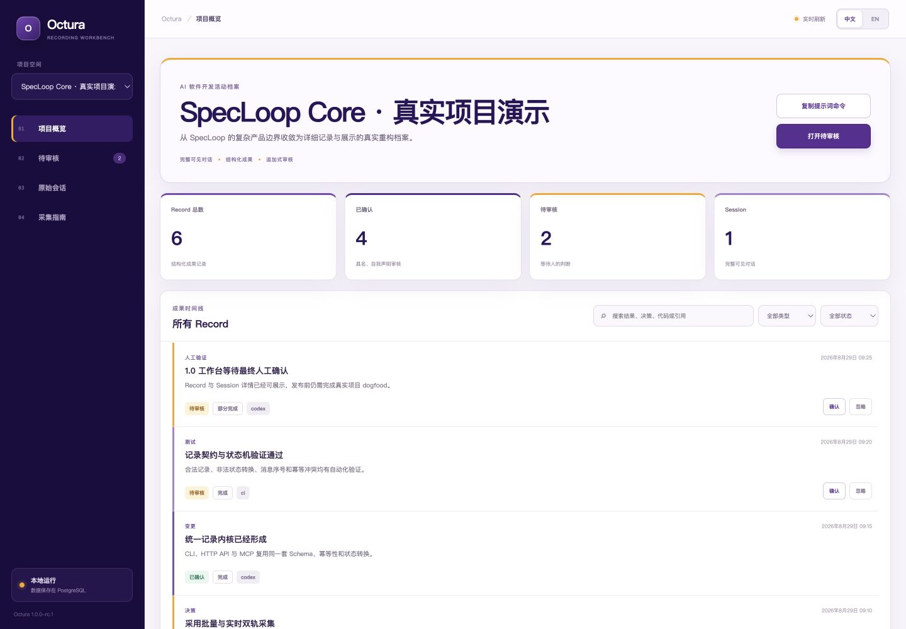
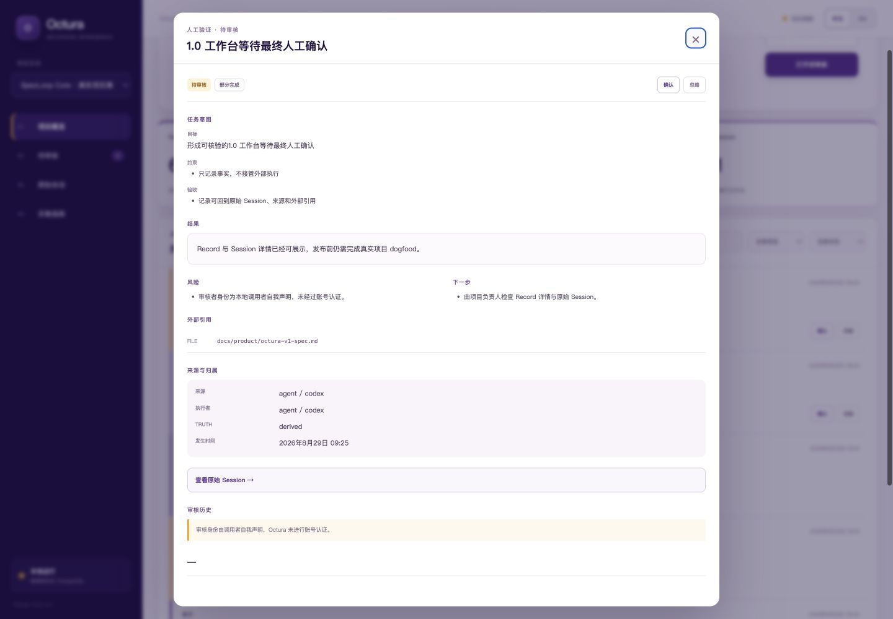

# Octura

**本地优先的 AI 软件开发记录工作台。**

Octura 保存一次开发活动的完整可见对话、结构化成果、来源和人工审核声明，让团队能回答：为什么做、人与 Agent 分别做了什么、证据在哪里、哪些结论经过确认。

Octura 只负责记录、查询、审核、修正和展示。它不执行代码，也不替代 Codex、Cursor、Claude Code、GitHub 或 CI。

## 3 分钟运行

需要 Docker Desktop 或兼容的 Docker Engine。

```bash
git clone https://github.com/fullstackinnoAI/octura.git
cd octura
docker compose up --build -d
docker compose exec octura octura-demo-seed --profile specloop-core
```

打开 [http://localhost:3000/?project=specloop-core](http://localhost:3000/?project=specloop-core)。演示项目包含：

- 一段完整可见的真实重构 Session；
- 总结、需求、决策、代码变更、测试和人工验证 Record；
- captured 与 reviewed 两个信任层；
- 可搜索时间线、Record 详情、原始 Session 和追加式审核历史。

## 工作台预览

项目概览只展示数据库中可直接计算的 Session、Record、待审核、已确认和来源数量；原始内容保持采集时语言，系统界面可切换中英文。



Record 详情保留任务意图、结果、变更、决策、验证、风险、外部引用、来源、审核历史与取代链。



检查运行状态：

```bash
docker compose exec octura octura-doctor --json
```

## Agent 的记录流程

```text
取得协议 → 生成结构化 Record → 保存可见对话与成果 → captured → 人工判断
```

### 1. 读取内置提示词和 Schema

```bash
docker compose exec octura octura-record-prompt --json
```

返回内容包含：

- `octura.recording-prompt.v1` 写作协议；
- `octura.record.v1` Record JSON Schema；
- `octura.capture.v1` 批量 Capture JSON Schema。

Octura 不调用模型。Agent 在自己的上下文中按协议生成 Record。

### 2. 创建项目

```bash
docker compose exec octura octura-project-create \
  --slug checkout-ai \
  --name "AI Checkout" \
  --description "结账流程的 AI 开发活动档案"
```

### 3. 原子保存一次开发活动

仓库提供了完整案例 [`examples/capture.json`](examples/capture.json)：

```bash
docker compose cp examples/capture.json octura:/tmp/capture.json
docker compose exec octura octura-capture-add \
  --project checkout-ai \
  --file /tmp/capture.json
```

Session、Messages 和 Records 在一个数据库事务中写入。任一内容无效时整体回滚；相同幂等键和相同内容可以安全重试。

### 4. 查询和阅读

```bash
docker compose exec octura octura-record-list \
  --project checkout-ai \
  --status captured \
  --q "支付" \
  --json
```

查看完整 Record、审核历史和 Session 关系：

```bash
docker compose exec octura octura-record-get \
  --project checkout-ai \
  --id <record-id> \
  --json
```

### 5. 明确作出审核判断

```bash
docker compose exec octura octura-record-review \
  --project checkout-ai \
  --id <record-id> \
  --action confirm \
  --reviewer "release-owner" \
  --note "已核对原始 Session、实现位置与测试结果" \
  --idempotency-key "review-payment-retry-v1"
```

`confirm` 仅适用于 captured，`dismiss` 仅适用于 captured，`retract` 仅适用于 reviewed。审核事件追加保存，不会改写历史。

本地 1.0 不提供账号系统。reviewer 是调用者的明确声明，工作台会展示 `self_asserted` 和调用入口，不把它描述成已认证身份。

## 实时 Session

长任务可以增量记录：

```bash
# 创建 open Session
docker compose exec octura octura-session-start \
  --project checkout-ai \
  --title "支付重试队列改造" \
  --source-type agent \
  --source-name codex \
  --actor-type agent \
  --actor-name codex \
  --idempotency-key "payment-session-v1" \
  --json

# 按服务端 nextSequence 追加可见消息
docker compose exec octura octura-session-append \
  --project checkout-ai \
  --session <session-id> \
  --expected-sequence 1 \
  --role user \
  --content "把支付重试迁移到异步队列" \
  --idempotency-key "payment-session-message-1"

# close.json 中包含一到多条 Record
docker compose exec octura octura-session-close \
  --project checkout-ai \
  --session <session-id> \
  --file /tmp/close.json
```

关闭后的 Session 不可继续追加或修改。取消任务可以使用 `action=abandon`，但必须提交原因。

## MCP stdio

`octura-mcp` 提供强类型本地工具：

```text
get_recording_protocol
create_project / list_projects
capture_activity
start_session / append_messages / close_session
list_sessions / get_session
create_record / list_records / get_record
review_record / supersede_record
```

在支持 MCP 的客户端中，可以通过 Docker 运行：

```json
{
  "mcpServers": {
    "octura": {
      "command": "docker",
      "args": ["compose", "exec", "-T", "octura", "octura-mcp"]
    }
  }
}
```

客户端工作目录需要指向包含 `docker-compose.yml` 的 Octura 仓库。MCP、CLI 和 HTTP API 使用相同应用服务、Schema、状态机与幂等规则。

## HTTP API

所有稳定接口位于 `/api/v1`，成功与失败都使用 `octura.api.v1` envelope。主要入口：

```text
GET  /api/v1/protocols/record
GET|POST /api/v1/projects
POST /api/v1/projects/:slug/captures
GET|POST /api/v1/projects/:slug/sessions
POST /api/v1/projects/:slug/sessions/:id/messages
POST /api/v1/projects/:slug/sessions/:id/close
GET|POST /api/v1/projects/:slug/records
GET  /api/v1/projects/:slug/records/:id
POST /api/v1/projects/:slug/records/:id/reviews
POST /api/v1/projects/:slug/records/:id/supersede
```

完整语义见 [Octura 1.0 产品规格](docs/product/octura-v1-spec.md) 和 [Agent 记录协议](docs/recording-protocol-v1.md)。

## 数据边界

Octura 只保存用户可见的 `user / assistant / system / tool` 内容。`analysis/reasoning` 角色、私钥和高置信度访问凭证会被拒绝；请先脱敏，不要把思维链或大段原始日志写入系统。

数据保存在 Docker volume `octura_data`：

```bash
docker compose down
```

普通停止不会删除数据。只有明确需要清空本地预览数据时才运行：

```bash
docker compose down -v
```

## 开发验证

```bash
pnpm install
pnpm test
pnpm typecheck
pnpm build
docker compose up --build -d
docker compose exec octura node scripts/smoke.mjs
```

Octura 1.0 的产品边界是详细记录与展示；账号、云同步、Agent 执行、CI 调度、自动总结、关系图谱和 Spec Kit 导入均不属于稳定契约。
